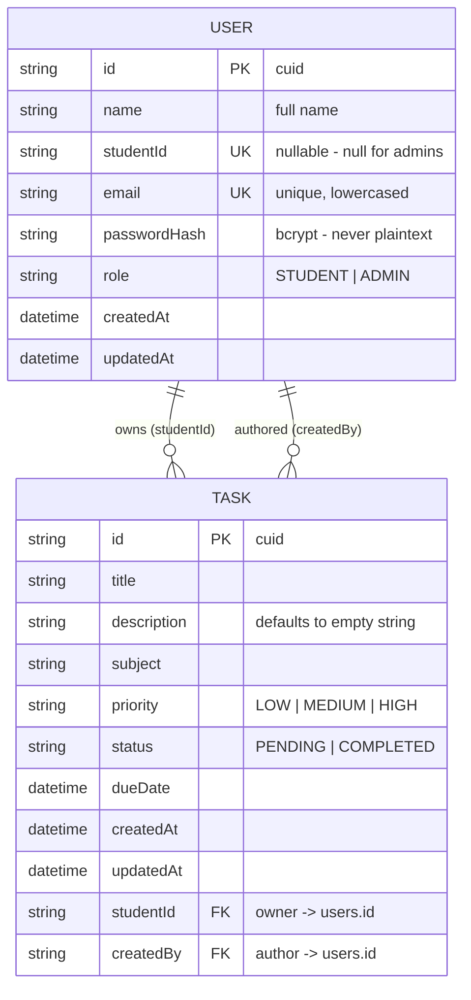

# Database

Data model, schema and persistence design for the Student Task / Assignment Manager.

**Contents**

1. [SQLite](#1-sqlite)
2. [Prisma ORM](#2-prisma-orm)
3. [Entity relationship diagram](#3-entity-relationship-diagram)
4. [The `User` model](#4-the-user-model)
5. [The `Task` model](#5-the-task-model)
6. [Relationships](#6-relationships)
7. [Enums on SQLite](#7-enums-on-sqlite)
8. [Indexes](#8-indexes)
9. [Derived data — overdue](#9-derived-data--overdue)
10. [Migrations](#10-migrations)
11. [Seed data](#11-seed-data)
12. [Example queries](#12-example-queries)
13. [Inspecting the database](#13-inspecting-the-database)

---

## 1. SQLite

The database is a single file:

```text
backend/prisma/dev.db
```

It is created locally by `npm run setup` and is **git-ignored** — the repository never contains
data, only the schema and the migrations needed to recreate it.

### Why SQLite

| Reason | Detail |
|---|---|
| Zero configuration | No server to install, no port, no user, no password |
| Instantly runnable | Clone → `npm install` → `npm run setup` → working database |
| Genuinely relational | Real foreign keys, transactions, indexes and `JOIN`s — not a toy store |
| Portable | The whole dataset is one file that can be copied, reset or inspected |
| Fully local | No cloud account, no network dependency, no credentials to leak |
| Appropriate to scale | A class of students generates thousands of rows, not millions |

SQLite is a real ACID-compliant relational database — it is the most widely deployed database engine
in the world. Its limitation for this project is write concurrency: it serialises writers. That is
irrelevant for a coursework tracker, and because access goes through Prisma, moving to PostgreSQL
later is largely a change of connector plus a fresh migration.

---

## 2. Prisma ORM

[Prisma](https://www.prisma.io/) sits between the application and SQLite.

```text
schema.prisma  ──prisma generate──▶  typed client  ──▶  SQL  ──▶  SQLite
      │
      └────────prisma migrate──────▶  versioned .sql migrations
```

What it gives this project:

- **Type safety.** The client is generated from the schema, so `task.subjekt` is a compile error,
  not a runtime `undefined`.
- **Migrations.** Every schema change becomes a reviewable, committed SQL file.
- **Injection safety.** All queries are parameterised. There is no string-concatenated SQL anywhere
  in the codebase.
- **Readable relations.** `include: { student: true }` instead of a hand-written `JOIN`.
- **One connection.** `config/prisma.ts` exports a single cached client so `tsx watch` reloads do not
  leak connections.

Configuration lives in `backend/prisma.config.ts` (the modern replacement for the deprecated
`package.json#prisma` block), which points at the schema, the migrations folder and the seed script.

---

## 3. Entity relationship diagram

### Mermaid



### ASCII

```text
                    ┌──────────────────────────────┐
                    │            USER              │
                    │           (users)            │
                    ├──────────────────────────────┤
                    │ id            TEXT    PK     │
                    │ name          TEXT           │
                    │ studentId     TEXT    UNIQUE │  ← NULL for admins
                    │ email         TEXT    UNIQUE │
                    │ passwordHash  TEXT           │  ← bcrypt
                    │ role          TEXT           │  ← STUDENT | ADMIN
                    │ createdAt     DATETIME       │
                    │ updatedAt     DATETIME       │
                    └───────┬──────────────┬───────┘
                            │              │
                  owns  1   │              │  1  authored
                            │              │
                        N   │              │  N
                            │              │
                    ┌───────▼──────────────▼───────┐
                    │            TASK              │
                    │           (tasks)            │
                    ├──────────────────────────────┤
                    │ id            TEXT    PK     │
                    │ title         TEXT           │
                    │ description   TEXT           │
                    │ subject       TEXT           │
                    │ priority      TEXT           │  ← LOW | MEDIUM | HIGH
                    │ status        TEXT           │  ← PENDING | COMPLETED
                    │ dueDate       DATETIME       │
                    │ createdAt     DATETIME       │
                    │ updatedAt     DATETIME       │
                    │ studentId     TEXT    FK ────┼──▶ users.id   (owner)
                    │ createdBy     TEXT    FK ────┼──▶ users.id   (author)
                    └──────────────────────────────┘

                    OVERDUE is NOT a column.
                    It is derived:  status = 'PENDING' AND dueDate < now
```

---

## 4. The `User` model

```prisma
model User {
  id           String   @id @default(cuid())
  name         String
  studentId    String?  @unique
  email        String   @unique
  passwordHash String
  role         String   @default("STUDENT")
  createdAt    DateTime @default(now())
  updatedAt    DateTime @updatedAt

  tasks        Task[]   @relation("TaskOwner")
  createdTasks Task[]   @relation("TaskCreator")

  @@index([email])
  @@index([studentId])
  @@index([role])
  @@map("users")
}
```

| Column | Type | Constraints | Notes |
|---|---|---|---|
| `id` | `String` | PK, `cuid()` | Collision-resistant and non-sequential, so ids do not leak how many users exist |
| `name` | `String` | required | 2–80 characters (enforced by Zod) |
| `studentId` | `String?` | unique, nullable | College roll number. `NULL` for admins — SQLite allows multiple `NULL`s in a `UNIQUE` column, so uniqueness still holds for every real ID |
| `email` | `String` | unique, required | Stored lowercased; the login identifier |
| `passwordHash` | `String` | required | bcrypt hash. **Never** returned by any endpoint — `toUserDTO()` strips it |
| `role` | `String` | default `"STUDENT"` | `STUDENT` or `ADMIN` |
| `createdAt` | `DateTime` | default `now()` | |
| `updatedAt` | `DateTime` | `@updatedAt` | Maintained automatically by Prisma |

### Why `studentId` is nullable

An administrator is a member of faculty, not a student, and has no roll number. The alternatives were
worse: a fake value like `"ADMIN-001"` pollutes the domain, and a separate `Admin` table duplicates
authentication logic across two models. A nullable column states the truth — *this user may or may
not have a roll number* — and the API layer requires it for the `STUDENT` role.

### Password storage

Only the bcrypt hash is ever persisted:

```text
Plaintext "Student@123"
        │  bcrypt.genSalt(10) + bcrypt.hash()
        ▼
"$2a$10$N9qo8uLOickgx2ZMRZoMye/IjZAgcfl7p92ldGxad68LJZdL17lhW"
```

bcrypt embeds a unique random salt in every hash, so two users with the same password still produce
different hashes, and it is deliberately slow, which makes brute-forcing the stored hashes expensive.
This is asserted by a test:

```ts
expect(user?.passwordHash).not.toBe(validRegistration.password);
expect(user?.passwordHash).toMatch(/^\$2[aby]\$/);
```

---

## 5. The `Task` model

```prisma
model Task {
  id          String   @id @default(cuid())
  title       String
  description String   @default("")
  subject     String
  priority    String   @default("MEDIUM")
  status      String   @default("PENDING")
  dueDate     DateTime
  createdAt   DateTime @default(now())
  updatedAt   DateTime @updatedAt

  studentId String
  student   User   @relation("TaskOwner", fields: [studentId], references: [id], onDelete: Cascade)

  createdBy String
  creator   User   @relation("TaskCreator", fields: [createdBy], references: [id], onDelete: Cascade)

  @@index([studentId])
  @@index([status])
  @@index([dueDate])
  @@index([subject])
  @@index([createdBy])
  @@index([studentId, status])
  @@map("tasks")
}
```

| Column | Type | Constraints | Notes |
|---|---|---|---|
| `id` | `String` | PK, `cuid()` | |
| `title` | `String` | required | 3–120 characters |
| `description` | `String` | default `""` | Up to 2000 characters; never `NULL`, which keeps search simple |
| `subject` | `String` | required | 2–60 characters, e.g. `DBMS` |
| `priority` | `String` | default `"MEDIUM"` | `LOW` \| `MEDIUM` \| `HIGH` |
| `status` | `String` | default `"PENDING"` | `PENDING` \| `COMPLETED` |
| `dueDate` | `DateTime` | required | The deadline |
| `createdAt` | `DateTime` | default `now()` | |
| `updatedAt` | `DateTime` | `@updatedAt` | |
| `studentId` | `String` | FK → `users.id`, cascade | **The owner** |
| `createdBy` | `String` | FK → `users.id`, cascade | **The author** |

`status` defaults to `PENDING` at the database level *and* is forced in the service layer, so a new
task cannot be created as already complete.

---

## 6. Relationships

One user has many tasks — expressed **twice**, because two different questions are being answered.

```text
User ──1────N──▶ Task     via studentId   (relation "TaskOwner")
     "whose dashboard does this appear on?"

User ──1────N──▶ Task     via createdBy   (relation "TaskCreator")
     "who wrote this?"
```

Prisma requires the named relations because two foreign keys point at the same model.

### What the two keys make possible

| `studentId` | `createdBy` | Meaning |
|---|---|---|
| `student-A` | `student-A` | A personal to-do the student created for themselves |
| `student-A` | `admin-1` | An assignment the professor gave to that student |

The comparison `createdBy !== studentId` is computed on read and surfaced as `assignedByAdmin`,
which is what drives the "Assigned" badge in the UI. No extra column is needed to record it.

### Cascade deletes

```prisma
onDelete: Cascade
```

Deleting a user removes their tasks. Without it, SQLite would either reject the delete or leave
orphaned rows pointing at a user that no longer exists.

### Class-wide assignments

When an admin assigns to `"ALL"`, the API creates **one row per student** in a single transaction:

```text
Admin creates "Mid-semester Review" for ALL
        │
        └─ prisma.$transaction([
             Task { title: "Mid-semester Review", studentId: A, createdBy: admin }
             Task { title: "Mid-semester Review", studentId: B, createdBy: admin }
             Task { title: "Mid-semester Review", studentId: C, createdBy: admin }
             Task { title: "Mid-semester Review", studentId: D, createdBy: admin }
           ])
```

This is deliberate. A single shared row with a `NULL` owner would mean:

- no way to record that student B finished it while student C has not;
- no per-student due-date extension;
- every ownership check needing a `NULL` special case.

One row per student keeps `studentId` non-nullable, keeps the ownership rule uniform, and lets each
student complete their own copy independently. The transaction guarantees the fan-out is
all-or-nothing.

---

## 7. Enums on SQLite

**Prisma does not support native `enum` blocks on the SQLite connector.** `enum` is available for
PostgreSQL, MySQL, MongoDB and SQL Server, but not SQLite.

Rather than switch database engine purely for enum syntax, the constrained values are enforced in
three layers:

```text
┌───────────────────────────────────────────────────────────┐
│ 1. TypeScript union types    src/types/domain.ts          │
│                                                           │
│    export const PRIORITIES = ['LOW','MEDIUM','HIGH'] as const;
│    export type Priority = (typeof PRIORITIES)[number];    │
│                                                           │
│    → invalid values are a compile error                   │
└───────────────────────────────────────────────────────────┘
┌───────────────────────────────────────────────────────────┐
│ 2. Zod schemas               src/schemas/task.schema.ts   │
│                                                           │
│    export const prioritySchema = z.enum(PRIORITIES, {     │
│      errorMap: () => ({ message: 'Priority must be LOW, MEDIUM or HIGH' })
│    });                                                    │
│                                                           │
│    → invalid values are rejected with 400 at the boundary │
└───────────────────────────────────────────────────────────┘
┌───────────────────────────────────────────────────────────┐
│ 3. Column defaults           prisma/schema.prisma         │
│                                                           │
│    priority String @default("MEDIUM")                     │
│    status   String @default("PENDING")                    │
│    role     String @default("STUDENT")                    │
│                                                           │
│    → a row can never be written without a valid value     │
└───────────────────────────------------------------------─┘
```

Because the single source of truth (`PRIORITIES`, `TASK_STATUSES`, `ROLES`) is shared by both the
types and the Zod schemas, they cannot drift apart.

Migrating to PostgreSQL later would allow real enums with a `CHECK`-equivalent at the storage layer;
the application-level constraints above would stay exactly as they are.

---

## 8. Indexes

Every index exists because a real query needs it.

### `users`

| Index | Type | Serves |
|---|---|---|
| `id` | primary key | `authenticate` — a lookup on **every single request** |
| `email` | unique + index | Login, and the duplicate check on registration |
| `studentId` | unique + index | Duplicate check on registration, admin search |
| `role` | index | `WHERE role = 'STUDENT'` for the admin student list and counts |

### `tasks`

| Index | Type | Serves |
|---|---|---|
| `id` | primary key | Fetch, update and delete by id |
| `studentId` | index | The single most common query: *this student's tasks* |
| `status` | index | Pending / completed filters and counters |
| `dueDate` | index | Default sort order, and the overdue query |
| `subject` | index | Subject filter and the `DISTINCT subject` dropdown |
| `createdBy` | index | Provenance lookups |
| `(studentId, status)` | **composite** | The dashboard's hot path |

The composite index is the interesting one. The dashboard runs:

```sql
SELECT * FROM tasks WHERE studentId = ? AND status = 'PENDING' ORDER BY dueDate;
```

A composite index on `(studentId, status)` satisfies both predicates in one traversal instead of
scanning every row a student owns and filtering afterwards. Column order matters: `studentId` is
first because it is the more selective column and is used alone in many other queries — an index on
`(studentId, status)` also serves a lookup on `studentId` by itself, so no separate index is wasted.

### Generated SQL

```sql
CREATE UNIQUE INDEX "users_studentId_key"        ON "users"("studentId");
CREATE UNIQUE INDEX "users_email_key"            ON "users"("email");
CREATE        INDEX "users_email_idx"            ON "users"("email");
CREATE        INDEX "users_studentId_idx"        ON "users"("studentId");
CREATE        INDEX "users_role_idx"             ON "users"("role");

CREATE        INDEX "tasks_studentId_idx"        ON "tasks"("studentId");
CREATE        INDEX "tasks_status_idx"           ON "tasks"("status");
CREATE        INDEX "tasks_dueDate_idx"          ON "tasks"("dueDate");
CREATE        INDEX "tasks_subject_idx"          ON "tasks"("subject");
CREATE        INDEX "tasks_createdBy_idx"        ON "tasks"("createdBy");
CREATE        INDEX "tasks_studentId_status_idx" ON "tasks"("studentId", "status");
```

---

## 9. Derived data — overdue

There is **no `OVERDUE` status and no `isOverdue` column.** A task is overdue when:

```text
status = 'PENDING'  AND  dueDate < now
```

```ts
export const isTaskOverdue = (
  task: Pick<Task, 'status' | 'dueDate'>,
  now: Date = new Date(),
): boolean => task.status === 'PENDING' && task.dueDate.getTime() < now.getTime();
```

### Why derive rather than store

A stored flag would be **wrong the moment a deadline passes**. Keeping it accurate would require a
scheduled job sweeping the table every midnight — more moving parts, and a window during which the
data lies. Deriving it on read is always correct, costs a single comparison, and cannot drift.

It also keeps `status` honest: a task is either pending or completed. "Overdue" is a *view* of a
pending task, not a third state — which is why a completed task is never marked overdue no matter
how late it was finished. A test asserts exactly that.

When overdue needs to be a filter, it becomes a query rather than a column read:

```ts
if (filters.overdue === true) {
  where.status = 'PENDING';
  where.dueDate = { lt: new Date() };
}
```

This is where the `dueDate` and `status` indexes earn their place.

---

## 10. Migrations

Migrations are committed to the repository, so the schema history is reviewable and reproducible.

```text
backend/prisma/migrations/
├── 20260810170359_init/
│   └── migration.sql
└── migration_lock.toml
```

### Commands

| Command | Use |
|---|---|
| `npx prisma migrate dev --name <name>` | **Development.** Creates a new migration from schema changes and applies it |
| `npx prisma migrate deploy` | **Setup / CI / production.** Applies committed migrations without generating new ones |
| `npx prisma migrate reset` | Drops the database, re-applies every migration from scratch |
| `npx prisma generate` | Regenerates the typed client after a schema change |
| `npm run db:reset` | Reset **and** re-seed in one step |

`npm run setup` uses `migrate deploy`, because a fresh clone only needs the committed migrations
applied — it should never generate a new one.

### Changing the schema

```bash
# 1. Edit backend/prisma/schema.prisma
# 2. Create and apply a migration
cd backend
npx prisma migrate dev --name add_task_attachments
# 3. The client is regenerated automatically; TypeScript now knows the new field
```

---

## 11. Seed data

`backend/prisma/seed.ts` populates a demonstrable dataset.

```bash
npm run db:seed
```

The script is **idempotent** — it clears `tasks` and then `users` (tasks first, because of the
foreign key) before inserting, so it can be run repeatedly without duplicating anything.

### Accounts created

> ⚠️ **Development / demo credentials only.** Created so the project is usable immediately after
> installation. Never use these in a real deployment.

| Role | Name | Email | Student ID | Password |
|---|---|---|---|---|
| `ADMIN` | Dr. Meera Krishnan | `admin@college.local` | `NULL` | `Admin@123` |
| `STUDENT` | Aarav Sharma | `student1@college.local` | `CS21B001` | `Student@123` |
| `STUDENT` | Priya Nair | `student2@college.local` | `CS21B002` | `Student@123` |
| `STUDENT` | Rahul Verma | `student3@college.local` | `CS21B003` | `Student@123` |
| `STUDENT` | Sneha Iyer | `student4@college.local` | `CS21B004` | `Student@123` |

### Tasks created

**19 tasks** across the four students, deliberately varied so every UI state is visible on first
login:

| Dimension | Coverage |
|---|---|
| Subjects | Data Structures, DBMS, Operating Systems, Machine Learning, Computer Networks, Software Engineering, Web Technologies, Discrete Mathematics, Compiler Design, Cloud Computing |
| Priorities | `HIGH`, `MEDIUM`, `LOW` |
| Statuses | `PENDING` and `COMPLETED` |
| Due dates | Past (**overdue**), today-ish, and up to two weeks ahead |
| Provenance | Some authored by the admin (class assignments, showing the "Assigned" badge), some by the students themselves |

Due dates are **relative to the moment the seed runs** (`daysFromNow(-2)`, `daysFromNow(+4)`, …), so
overdue tasks stay overdue no matter when the project is demonstrated — they never go stale the way
hard-coded dates would.

Two tasks are shared by all students — *Data Structures Assignment 3* and *DBMS Normalization
Worksheet*, both authored by the admin — which demonstrates the class-assignment feature with data
that already exists. Students have completed different subsets of them, so the admin's student
progress table shows genuinely differing completion rates.

---

## 12. Example queries

How the application actually reads and writes, via Prisma.

### A student's tasks, filtered and sorted

```ts
await prisma.task.findMany({
  where: {
    studentId: 'clx...',            // forced from the JWT - never the request body
    status: 'PENDING',
    priority: 'HIGH',
    OR: [                            // the search box
      { title:       { contains: 'database' } },
      { subject:     { contains: 'database' } },
      { description: { contains: 'database' } },
    ],
  },
  orderBy: [{ dueDate: 'asc' }, { createdAt: 'desc' }],
  include: {
    student: { select: { id: true, name: true, studentId: true, email: true } },
    creator: { select: { id: true, name: true, role: true } },
  },
});
```

`contains` compiles to SQL `LIKE`, which SQLite evaluates **case-insensitively for ASCII** — so
searching `dbms`, `DBMS` or `Dbms` all match. (Verified: each returns the same result.)

### Overdue tasks

```ts
await prisma.task.findMany({
  where: { status: 'PENDING', dueDate: { lt: new Date() } },
  select: { studentId: true },
});
```

### Per-student counters without N+1 queries

```ts
await prisma.task.groupBy({
  by: ['studentId', 'status'],
  _count: { _all: true },
});
```

One `GROUP BY` produces counts for every student at once. The naive alternative — looping over
students and counting each — would issue one query per student and get slower as the class grows.

### Assigning to the whole class, atomically

```ts
await prisma.$transaction(
  studentIds.map((studentId) =>
    prisma.task.create({ data: { ...taskData, studentId }, include: taskWithRelations }),
  ),
);
```

### Subject list for the filter dropdown

```ts
await prisma.task.findMany({
  where: { studentId },
  select: { subject: true },
  distinct: ['subject'],
  orderBy: { subject: 'asc' },
});
```

### Sorting by priority

`priority` is stored as text, so the database would order it alphabetically — `HIGH` < `LOW` <
`MEDIUM`, which is not what "sort by priority" means. The repository therefore re-orders by rank in
memory:

```ts
const PRIORITY_RANK = { HIGH: 3, MEDIUM: 2, LOW: 1 };
```

Task lists are scoped to one student or one class, so the cost is negligible. With a
PostgreSQL-native enum this would become a plain `ORDER BY`.

---

## 13. Inspecting the database

### Prisma Studio (recommended)

```bash
npm run db:studio
```

Opens a browser GUI at `http://localhost:5555` for browsing and editing both tables — a good way to
show a database is genuinely behind the app during a demonstration.

### SQLite CLI

```bash
cd backend/prisma
sqlite3 dev.db

.tables                                   -- users  tasks  _prisma_migrations
.schema tasks
SELECT name, email, role FROM users;
SELECT title, subject, priority, status, dueDate FROM tasks LIMIT 10;

-- overdue tasks, derived rather than stored
SELECT title, dueDate FROM tasks
WHERE status = 'PENDING' AND dueDate < datetime('now');

-- confirm the index is used
EXPLAIN QUERY PLAN
SELECT * FROM tasks WHERE studentId = 'x' AND status = 'PENDING';
```

### Resetting

```bash
npm run db:reset      # drop, re-migrate, re-seed
npm run db:seed       # re-seed only
```

Because the seed clears both tables first, `db:seed` alone is enough to return to a pristine demo
state after experimenting.

### Verifying persistence

Data survives a server restart — it is on disk, not in memory:

```bash
npm run dev           # create a task in the UI
# stop the server (Ctrl+C), start it again
npm run dev           # the task is still there
```
